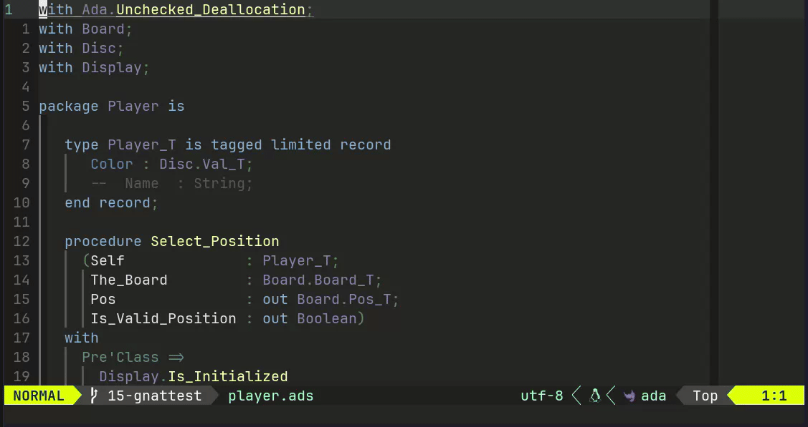
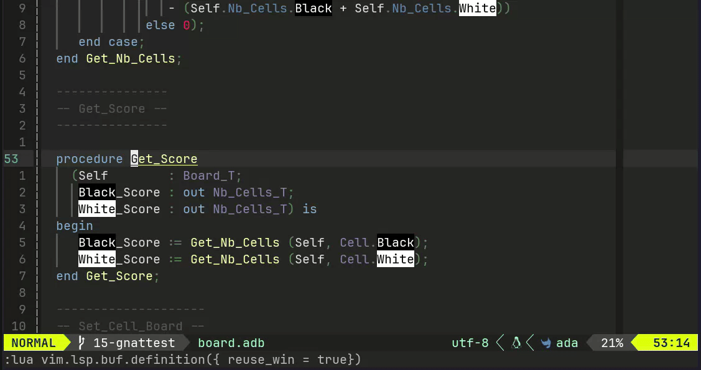

# GNATtest.nvim

[](https://github.com/StevenBias/gnattest.nvim/actions)
[](https://opensource.org/licenses/MIT)
[](https://neovim.io)

> Neovim plugin providing GNATtest workflow integration: generate, build, run, clean tests and navigate between source and test files

## ✨ Features

- 🔒 **Read-only Protection** - Automatically protect auto-generated test regions
- 🔄 **Smart Navigation** - Jump between source and test files with LSP integration
- ⚡ **Command Integration** - Run GNATtest directly from Neovim
- 🎨 **Syntax Highlighting** - Visual indicators for protected code regions
- 🔍 **XML Parsing** - Automatic test metadata extraction
- ✅ **Tab Completion** - Command and argument autocompletion

## 📦 Installation

### lazy.nvim

```lua
{
  "StevenBias/gnattest.nvim",
  dependencies = {
    "nvim-treesitter/nvim-treesitter",
  },
  ft = { "ada" },
  config = function()
    require("gnattest").setup()
  end,
}
```

### vim-plug

```vim
Plug 'nvim-treesitter/nvim-treesitter'
Plug 'StevenBias/gnattest.nvim'

lua << EOF
require("gnattest").setup()
EOF
```

## 🔧 Requirements

- **Neovim** >= 0.10
- **Ada Language Server** - Must be configured and running ([setup guide](https://github.com/AdaCore/ada_language_server))
- **GNAT Project File** - Only Ada projects using `.gpr` files are supported (GNATtest must be configured in the `.gpr` file)
- **GNATtest** - Unit testing framework for Ada ([user's guide](https://docs.adacore.com/gnatcoverage-docs/html/gnattest/gnattest_part.html#gnattest-user-s-guide))
- **Treesitter parsers**: `ada`, `xml`
  ```vim
  :TSInstall ada xml
  ```

## 🚀 Quick Start

```lua
require("gnattest").setup()
```

That's it! The plugin will automatically activate for Ada files in GNATtest projects.

## 📚 Usage

### Commands

All commands are subcommands of `:Gnattest`:

- `:Gnattest generate` - Generate test harness from source files
- `:Gnattest build` - Build the test project
- `:Gnattest run [package:subprogram]` - Run specific test (with tab completion)
- `:Gnattest run_all` - Run entire test suite
- `:Gnattest clean` - Clean test build artifacts
- `:Gnattest switch` - Toggle between source and test file

### Examples

**Generate and run tests:**
```vim
:Gnattest generate
:Gnattest build
:Gnattest run_all
```

**Navigate to a specific test:**
```vim
" Place cursor on a subprogram in your source file
:Gnattest switch
" You'll be taken to the corresponding test file
```

**Run a specific test:**
```vim
:Gnattest run Board:Init
" Tab completion available for package:subprogram names
```

### Read-only Protection

GNATtest generates test harnesses with protected regions marked by comments:
```ada
--  begin read only
   -- Auto-generated code here
--  end read only
```

The plugin automatically:
- Highlights these regions with a 🔒 icon
- Prevents editing (changes are automatically reverted)
- Shows notifications when you attempt to modify protected code

**⚠️ Disclaimer:** The read-only protection feature is provided as-is. While it 
works in most common scenarios, there may be edge cases or unknown issues where 
protection could fail. Always verify that protected regions remain intact, 
especially before committing changes. Use version control to safeguard your work.

## ⚙️ Configuration

The plugin is designed to work with minimal configuration:

```lua
require("gnattest").setup()
```

### Available Options

Currently, only region marker text is configurable:

```lua
require("gnattest").setup({
  region_text = {
    start = "begin read only",  -- Default
    ending = "end read only",   -- Default
  }
})
```

**Note:** These are GNATtest's standard markers. Most users should not need to change them.

## 🎯 About This Project

This is my first public Neovim plugin. I created it to:
- Learn modern Neovim plugin development practices
- Improve my Ada development workflow
- Explore LSP integration, Treesitter parsing, and extmarks
- Practice professional software engineering (testing, CI/CD, documentation)
- Understand GNATtest's workflow and integration possibilities

### Key Learning Areas

- **Architecture**: Modular design with 7 specialized modules
- **LSP Integration**: Deep integration with Ada Language Server for project information and navigation
- **Testing**: Comprehensive test suite achieving 99.82% coverage with dual-mode testing
- **CI/CD**: Full automated pipeline with formatting, linting, and cross-version testing
- **Best Practices**: Following [Neovim plugin best practices](https://github.com/lumen-oss/nvim-best-practices), including proper command structure with tab completion
- **Treesitter**: Using parsers for Ada syntax and GNATtest XML metadata
- **GNATtest**: Understanding test generation, harness structure, and integration patterns

### Development Notes

Tests and documentation were generated with AI assistance.

While functional and well-tested, this plugin reflects my learning journey. 
Feedback and contributions are welcome.

## ⚠️ Known Limitations

### Requirements

- Ada Language Server must be configured before plugin activation
- GNATtest tool must be installed separately
- Treesitter parsers required: `ada`, `xml`

**⚠️ Note:** This plugin only supports Ada projects that use GNAT project files (`.gpr`). GNATtest must be configured in the `.gpr` file. Projects without `.gpr` files are not supported.

### Features

- Limited configuration options (by design for simplicity)
- GNATtest `Tests_Root` attribute not supported

### Compatibility

- Tested on Linux (Ubuntu in CI)
- Requires Neovim >= 0.10

## 🤝 Contributing

Contributions welcome! See [CONTRIBUTING.md](CONTRIBUTING.md) for guidelines.

As this is a learning project, I'm particularly interested in:
- Bug reports and fixes
- Documentation improvements
- Usability feedback
- Feature suggestions

## 📸 Demo

### Command Integration



*Demonstrates available GNATtest commands with tab completion.*

### Navigation & Read-only Protection



*Shows `:Gnattest switch` to navigate between source and test files, plus read-only region protection in action.*

### Build and Run Specific Test


*Example of building the test project and running a specific test using `:Gnattest run` with package:subprogram syntax.*

## 🔗 Related Projects

- [Ada Language Server](https://github.com/AdaCore/ada_language_server) - LSP server for Ada
- [GNATtest User's Guide](https://docs.adacore.com/gnatcoverage-docs/html/gnattest/gnattest_part.html#gnattest-user-s-guide) - Official GNATtest documentation
- [Neovim Best Practices](https://github.com/lumen-oss/nvim-best-practices) - Plugin development guidelines

## 📜 License

MIT License - see [LICENSE](LICENSE) for details.
